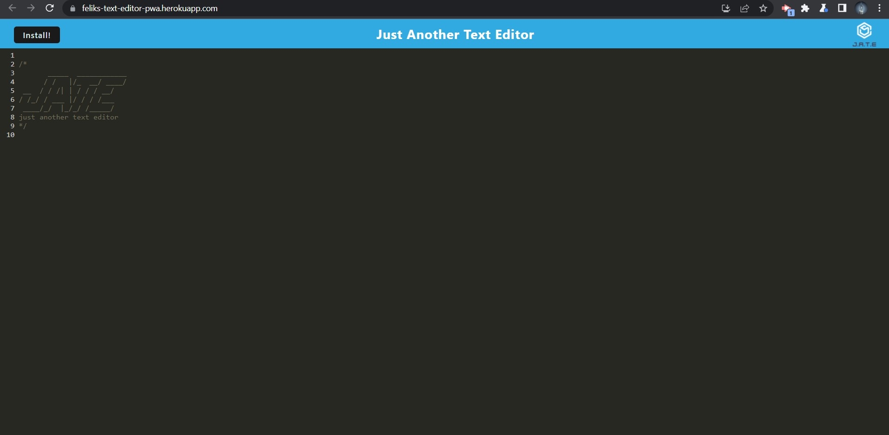
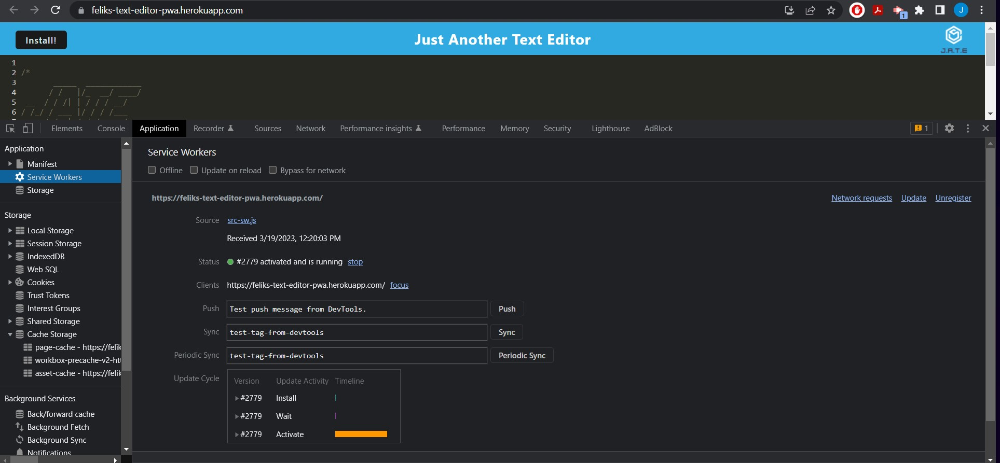
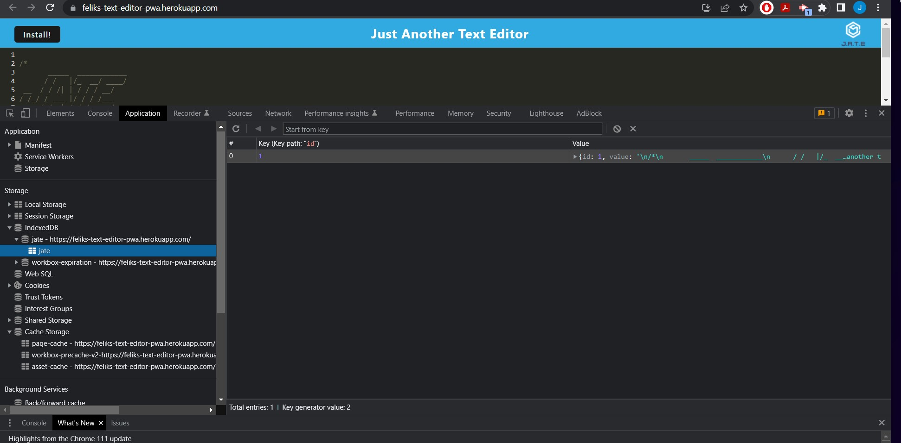

  # Text-Editor-WPA
  

      
  
  ## Table-of-Contents
  * [Description](#description)
  * [Installation](#installation)
  * [Usage](#usage)
  * [License](#License)
  * [Contributing](#Contributors)
  * [Tests](#tests)
  * [Questions](#questions)
  * [Screenshots](#Screenshots)
    
  ## Description
Web-text editor  is  single-page application that meets the PWA criteria. It includes    number of data persistence techniques that serve as redundancy in case one of the options is not supported by the browser. The application can be run online of offline. Moreover can be installed as a client.
  ## Installation
 clone or download the repo. 

 Run:  npm install
 Then all the dependencies indicated in the package.json file will be installed 

  ## Usage
  run "npm run start:dev

 ## Deployed app
 [link to deployed app](https://feliks-text-editor-pwa.herokuapp.com/) 
 ## Screenshots

  ## License
  This application is covered  under the mit license.
  
  license details:  [mit](https://choosealicense.com/licenses/mit)

  ## Contributors
  bootcamp UNB(starter code)

  ## Tests
  no links
  ## Questions
  Please contact me using the following links:
  [GitHub](https://github.com/felixbor) 

  [App-repo](https://github.com/felixbor/Text-Editor-PWA)

  [Emailme ](mailto:felxbor@gmail.com)
  
